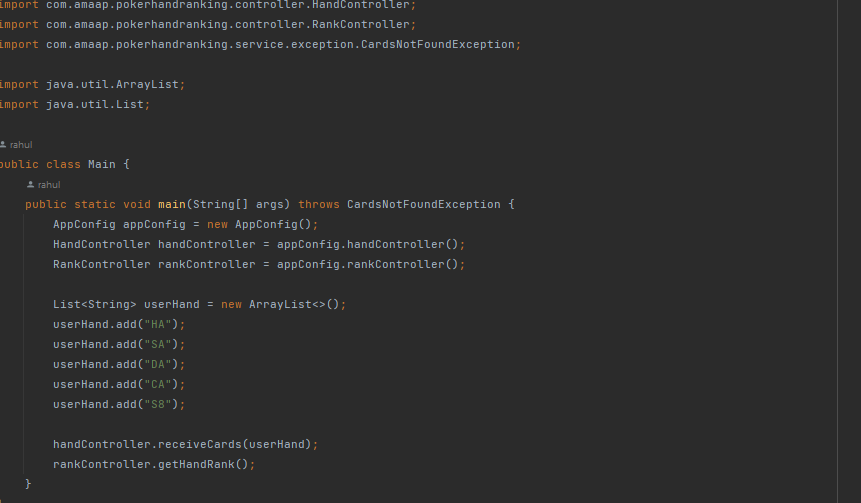
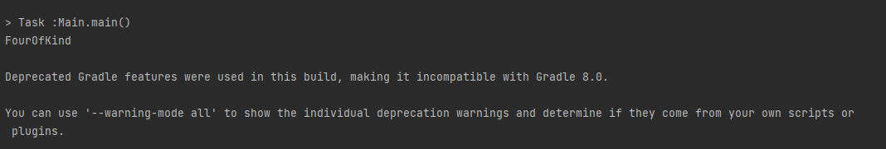

# Poker Hand Evaluation

## Poker Best Hand Extension

### New Hand Rankings:
1. **Straight Flush**: All cards in the same suit, and in sequence.
2. **Four of a Kind**: Four of the cards have the same rank.
3. **Full House**: Three cards of one rank, the other two of another rank.
4. **Flush**: All cards in the same suit.
5. **Straight**: All cards in sequence (aces can be high or low, but not both at once).
6. **Three of a Kind**: Three of the cards have the same rank.
7. **Two Pair**: Two pairs of cards have the same rank.
8. **Pair**: Two cards have the same rank.
9. **High Card**: None of the above conditions are met. The high card rule should return the highest card as well. For example, `["S2", "D5", "C7", "ST", "HA"]` should return `high-card-ace`.

## Design Analysis

### HandController
- `receiveHandCards(List<String> cards)`: Receives cards from the user.

### RankController
- `getHandRank()`: Used to get the hand rank.

### OuterService

#### CardService
- `boolean HandService(List<String> cards)`:
  - Performs structural validations and checks the count of cards.
  - Passes the validated cards to the inner service for further validation.
  - If valid, sends the cards back to the outer service to be stored in the repository.

### RankEvaluator Service
- `public void getRank()`:
  - Calls the inner service to get the hand rank and prints the hand ranking.

## Domain

### Model
- `Rank`: Enum representing the rank of a card.
- `Suit`: Enum representing the suit of a card.
- `Card`: Class representing a card with a rank and suit.

### InnerService

#### CardParser
- `public boolean validateCard(List<String>)`
- `public Card parseCard(String card)`

#### HandEvaluator
- `public String evaluate(List<String>)`: Returns the hand ranking as a string.

#### CardConvertor
- `public List<Card> convertToCardList(List<String> cards)`: Returns a list of `Card` objects which were initially a list of strings.

#### HandRanking [Interface]
- `boolean evaluate(List<Card> hand)`: Used to implement the hand ranking classes and reflects the Strategy Design Pattern.

#### Implementation
- `boolean Flush(List<Card>)`
- `boolean FourOfAKind(List<Card>)`
- `boolean FullHouse(List<Card>)`
- `boolean HighCard(List<Card>)`
- `boolean Pair(List<Card>)`
- `boolean TwoPair(List<Card>)`
- `boolean RoyalFlush(List<Card>)`
- `boolean Straight(List<Card>)`
- `boolean StraightFlush(List<Card>)`
- `boolean ThreeOfAKind(List<Card>)`
- `public Map<Rank, Integer> rankCount(List<Card> cards)`

## Repository

### HandRepository [Interface]
- `HandRepository`: Repository where the five cards are stored.
- `List<String> getCards()`: Used to get the stored cards.

## AppConfig
Used for dependency injection.

## Main
Main file to run the program.

## Output:

## Design Pattern
Used Strategy Design Pattern as for each hand rank we have different logic to recognize the cards.

## Usage
- The `HandController` is responsible for receiving the hand of cards.
- The `HandRankController` interacts with the `OuterService` to get the hand rank.
- The `OuterService` performs initial validations and interacts with the `InnerService`.
- The `InnerService` handles detailed validation, parsing, and storing of the cards.
- The `Domain` models the structure of cards, ranks, and suits.
- The `Repository` is used for storing the validated hand of cards.
